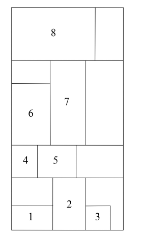

# COP4533
COP4533 Algorithm Abstraction and Design - University of Florida 

# Algorithm Design Project: Optimal Sculpture Arrangement for Art Exhibition

## Problem Definition

Consider the problem of curating an art exhibition featuring `n` sculptures that must be displayed in a specific sequence determined by the theme of the show; thus, their order cannot be changed. Each sculpture `s_i`, where `1 ≤ i ≤ n`, has a base width `w_i` and a height `h_i`. The gallery space is divided into display platforms, each with a fixed maximum width `W`. The total width of the sculptures placed on a single platform cannot exceed `W`. We have the flexibility to adjust the height of each platform to match the tallest sculpture placed upon it. 

The goal is to determine an assignment of the sculptures to platforms that minimizes the total cost. The cost of a particular arrangement is the sum of the heights of the tallest sculptures on each platform.

### Display Example

Below is a visual example of how the sculptures could be arranged across multiple platforms:

### Example 1:
- **Number of sculptures**: n = 7   
- **Platform width**: W = 10
- **Heights**: h = [21, 19, 17, 16, 11, 5, 1]
- **Widths**: w = [7, 1, 2, 3, 5, 8, 1]

#### Solution:
- Platform 1: [s1...s3]
- Platform 2: [s4...s5]
- Platform 3: [s6...s7]
- **Total cost**: 21 + 16 + 5 = 42

### Example 2:
- **Number of sculptures**: n = 4
- **Platform width**: W = 10
- **Heights**: h = [8, 10, 9, 7]
- **Widths**: w = [8, 1, 2, 2]

#### Solution:
- Platform 1: [s1]
- Platform 2: [s2...s4]
- **Total cost**: 8 + 10 = 18

### Example 3:
- **Number of sculptures**: n = 7
- **Platform width**: W = 10
- **Heights**: h = [12, 10, 9, 7, 8, 10, 11]
- **Widths**: w = [3, 2, 3, 4, 3, 2, 3]

#### Solution:
- Platform 1: [s1...s3]
- Platform 2: [s4]
- Platform 3: [s5...s7]
- **Total cost**: 12 + 7 + 11 = 30

Below is the formal problem definition, starting with the general version, followed by two special cases. The special cases include input restrictions, which may allow for more efficient solutions.

The general version seeks to optimize platform arrangement to minimize total height.

## ProblemG

**Given the heights `h1, ..., hn` and the base widths `w1, ..., wn` of `n` sculptures, along with the width `W` of the display platform, find an arrangement of the sculptures on platforms that minimizes the total height.**

## ProblemS1

**Given the heights `h1, ..., hn`, where `hi ≥ hj` ∀`i < j`, and the base widths `w1, ..., wn` of `n` sculptures, along with the width `W` of the display platform, find an arrangement of the sculptures on platforms that minimizes the total height.**

(Note: The heights of the sculptures form a monotonically non-increasing sequence, as in Example 1.)

## ProblemS2

**Given the heights `h1, ..., hn`, where ∃`k` such that ∀`i < j ≤ k`, `hi ≥ hj` and ∀`k ≤ i < j`, `hi ≤ hj`, and the base widths `w1, ..., wn` of `n` sculptures, along with the width `W` of the display platform, find an arrangement of the sculptures on platforms that minimizes the total height.**

(Note: The heights of the sculptures follow a ***unimodal function*** with a ***single local minimum***, as in Example 3.)

---

## MILESTONE 1 - Greedy Algorithms

For the first part of the project, you will design, analyze, and implement greedy algorithms to solve the special cases of the problem. You will conduct an experimental study on the performance of your algorithms. You are also required to construct examples showing how an algorithm developed for a special case of the problem might not work for the general version of the problem.

### 2.1 Design, Analysis, and Implementation Tasks

**Algorithm1**: Design a **Θ(n)** time greedy algorithm for solving **ProblemS1**.

**Analysis1**: Prove the **correctness** of your greedy **Algorithm1** for solving **ProblemS1**.

**Question1**: Give an input example showing that **Algorithm1** does not always solve **ProblemG**.

**Question2**: Give an input example showing that **Algorithm1** does not always solve **ProblemS2**.

**Program1**: Provide an implementation of your greedy **Algorithm1**.

**Algorithm2**: Design a **Θ(n)** time greedy algorithm for solving **ProblemS2**.

**Analysis2**: Prove the **correctness** of your greedy **Algorithm2** for solving **ProblemS2**.

**Program2**: Provide an implementation of your greedy **Algorithm2**.

---

### 2.2 Experimental Comparative Study

Test your implementations extensively for **correctness** and **performance**.

For this purpose, you should create randomly generated input files of various sizes. The exact size of the experimental data sets that your program can handle depends on the quality of your implementation. For instance, you might want to choose `n = 1000, 2000, 3000, 4000, 5000` to create at least five data sets for each experiment.

Then, you should conduct and present a performance comparison of the following:

- **Plot1**: Plot the running time of **Program1** with respect to varying input size (as x-axis).
- **Plot2**: Plot the running time of **Program2** with respect to varying input size (as x-axis).

For each comparison, generate a two-dimensional plot of running time (y-axis) against input size (x-axis). These should be included in your report along with additional comments/observations.

### 2.3 Report

Prepare a report that describes the design and analysis of your algorithms, presents the results of your experimental study, and summarizes your learning experience. Your report should include, but is not limited to, the following sections:

- **Team Members**: You may choose to work alone or in a team of up to three students on this assignment. If you choose to work in a team, clearly state the name and the contribution of each team member.
  
- **Algorithm Design and Analysis**: Provide a clear description of your algorithm design as well as its analysis. You can also include the pseudo code of your algorithms. Make sure to provide the answers to **Question1** and **Question2** as well.

- **Experimental Study**: Present the results of your experimental study. Include all your plots along with any explanation and comments you wish to provide.

- **Conclusion**: Summarize your learning experience from the first component of the project. For each programming task, comment on the ease of implementation and any other potential technical challenges.

### 2.4 Deliverables

The following contents are required for **Milestone 1** submission:

- **Implementation**: Submit the implementation code on Gradescope. Refer to Section 5 for more details. Make sure to include detailed comments next to each non-trivial block of code.
  
- **Report**: The report, in PDF format, must be submitted on Canvas.

---

## **MILESTONE 2** - Dynamic Programming Algorithms

For the second part of the project, you will design, analyze, and implement dynamic programming algorithms to solve the general cases of the problem. You will conduct an experimental study on the performance of your algorithms.

### 3.1 Design, Analysis, and Implementation Tasks

- **Algorithm3**:   Design a **Θ(n2ⁿ⁻¹)** time naive algorithm for solving **ProblemG**.

- **Analysis3**:    Give an analysis (correctness & running time) of **Algorithm3** for solving **ProblemG**.

- **Algorithm4**:   Design either a **Θ(n³)** time dynamic programming algorithm or a **Θ(n²|W|)** time dynamic programming algorithm for solving **ProblemG**.

- **Analysis4**:    Give an analysis (correctness & running time) of **Algorithm4** for solving **ProblemG**.

- **Algorithm5**:   Design a **Θ(n²)** time dynamic programming algorithm for solving **ProblemG**.

- **Analysis5**:    Give an analysis (correctness & running time) of **Algorithm5** for solving **ProblemG**.

- **Program3**:     Give an implementation of **Algorithm3**.

- **Program4**:     Give an implementation of **Algorithm4**.

- **Program5A**:    Give a **top-down recursive** implementation of **Algorithm5** using memoization.

- **Program5B**:    Give an **iterative bottom-up** implementation of **Algorithm5**.

---

### 3.2 Experimental Comparative Study

Test your implementations extensively for correctness and performance. For this purpose, you should create randomly generated input files of various sizes. The exact size of the experimental data sets that your program can handle depends on the quality of your implementation. For instance, you might want to choose `n = 1000, 2000, 3000, 4000, 5000` to create at least five data sets for each experiment. Then, you should conduct and present a performance comparison of the following:

For each comparison, generate a two-dimensional plot of running time (y-axis) against input size (x-axis). These should be included in your report along with additional comments/observations.

- **Plot3**: Plot the running time of Program3 with respect to varying input size (as x-axis).
- **Plot4**: Plot the running time of Program4 with respect to varying input size (as x-axis).
- **Plot5**: Plot the running time of Program5A with respect to varying input size (as x-axis).
- **Plot6**: Plot the running time of Program5B with respect to varying input size (as x-axis).
- **Plot7**: Overlay Plots 3, 4, 5, and 6, contrasting the performance of Programs 3, 4, 5A, and 5B.
- **Plot8**: Overlay Plots 5 and 6, contrasting the performance of Programs 5A and 5B.

In addition to testing the running time performance of the algorithms described above, you are asked to conduct experiments to test the quality of the output of Program1, which implements greedy Algorithm1 when it is run on the general case of the problem ProblemG. Note that such a solution is not guaranteed to be optimal. Your task is to determine how different it is from the optimal.

Make sure to conduct enough experiments with many random data sets. For the x-axis, simply use `n` as the varying input size. On the y-axis, you can plot `(hg - ho) / ho`, where `ho` is the optimal height determined by any of Programs 3, 4, 5A, or 5B, and `hg` is the height determined by Program1.

- **Plot9**: Plot the output quality comparison `(hg - ho) / ho` of Program1 and any of Programs 3, 4, 5A, or 5B.

---

### 3.3 Report

Prepare a report that describes the design and analysis of your algorithms, presents the results of your experimental study, and summarizes your learning experience. Your report should include, but is not limited to, the following sections:

- **Team Members**: You may choose to work alone or in a team of up to three students on this assignment. If you choose to work in a team, clearly state the name and the contribution of each team member.
  
- **Algorithm Design and Analysis**: Provide a clear description of your algorithm design as well as its analysis. Make sure to include the recursive formulation expressing the optimal substructure for the dynamic programming algorithms. You can also include the pseudo code of your algorithms.

- **Experimental Study**: Present the results of your experimental study. Include all your plots along with any explanation and comments you wish to provide.

- **Conclusion**: Summarize your learning experience on the second component of the project. For each programming task, comment on the ease of implementation and other potential technical challenges.

---

### 3.4 Deliverables

The following contents are required for Milestone 2 submission:

- **Implementation**: Submit the implementation code on Gradescope. Refer to Section 5 for more details. Make sure to include detailed comments next to each non-trivial block of code.
  
- **Report**: The report, in PDF format, must be submitted on Canvas.

---

## MILESTONE 3 - Video Presentation

Prepare a video of length between 5 to 7 minutes, that presents all your results (design, analysis, experiments, and learning experience). We will provide more details regarding the submission and grading criteria on this component of the project.

---

## 5. Language/Input/Output Specifications

You may use C++, Java, or Python. Starter code for each language is provided (they differ only in filenames and class names). Add your implementation to the provided starter code in the language of your choice. Do not modify the filenames or class names in the given code. You must upload a file for each program on Gradescope (1 file per program). Do not include any extra files. You will receive instant feedback for a few example test cases to verify that your code follows the correct specifications.

The autograder on Gradescope runs on an Ubuntu 22.04 image. C++ code will be compiled using `g++ 11.4.0` with the `-std=gnu++17` compile flag. Java code will be compiled and evaluated using OpenJDK 17. Python code will be evaluated using Python 3.10.

For convenience, you can assume that `1 ≤ n, W < 10^5`, and ∀`i 1 ≤ h[i], w[i] < 10^5`. Test cases will be generated to accommodate the required time complexity.

### Input

Your program will read input from standard input (stdin) in the following order:

- Line 1 consists of two integers `n`and `W` separated by a single space.
- Line 2 consists of `n` integers (heights of `n` sculptures) separated by a single space.
- Line 3 consists of `n` integers (base widths of `n` sculptures) separated by a single space.

### Output

Your program should print to standard output (stdout) in the following order:

- Line 1 contains the number of platforms used (denoted as `m`).
- Line 2 contains the optimal total height.
- The next `m` lines should consist of the number of statues on each platform.

---

## 6. Grading Policy

Milestones 1, 2, and 3 will weigh 30%, 50%, and 20% of your total project grade, respectively. On each Milestone, there will be 20% bonus points.

For Milestones 1 and 2, grades will be based on the correctness & efficiency of algorithms and the quality of your experimental study and report:

- **Program 60%**: Correct/efficient design and implementation/execution. Also, make sure to include comments with your code for clarity.
  
- **Report 40%**: Quality (clarity, details) of the write-up on your design, analysis, programming experience, and experimental study.
